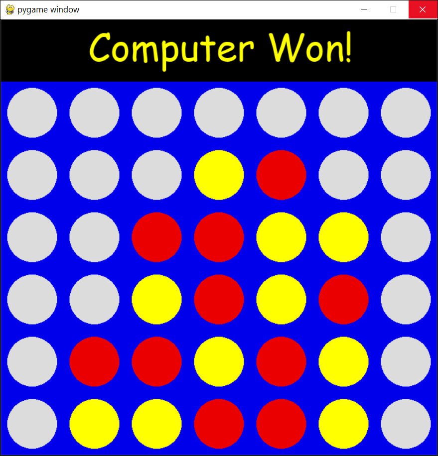

# Connect Four Game with AI Opponent

Welcome to the Connect Four game with an AI opponent project! This interactive game allows you to play Connect Four against a challenging AI player powered by the Minimax algorithm with alpha-beta pruning. Additionally, this project includes a neural network-based AI opponent in the 'neuralnetworks.py' module for an alternative gameplay experience.

## Table of Contents
- [Game Overview](#game-overview)
- [Installation](#installation)
- [How to Play](#how-to-play)
- [AI Opponents](#ai-opponents)
  - [Minimax with Alpha-Beta Pruning](#minimax-with-alpha-beta-pruning)
  - [Neural Network AI](#neural-network-ai)
- [Technologies Used](#technologies-used)

## Game Overview

Connect Four is a classic two-player board game where the objective is to connect four of your own chips in a row, either vertically, horizontally, or diagonally. This project brings this timeless game to life with a dynamic interface and the challenge of facing both traditional AI and neural network-based AI opponents.

## Installation

To play the game locally, follow these steps:

1. Clone this repository to your local machine using `git clone`.
2. Make sure you have Python 3.x installed.
3. Install the required libraries by running `pip install pygame tensorflow numpy`.

## How to Play

1. Run the game by executing `python MAxmin_ABpruning.py` in your terminal.
2. The game will display a Connect Four board, and you'll be randomly assigned as either Player 1 or Player 2.
3. If you're Player 1, click on the column where you want to drop your chip. If you're Player 2, the AI will automatically make its move.
4. Continue taking turns until one player successfully connects four chips in a row or the board is full.
5. The game will declare the winner or a draw and allow you to play again.

## AI Opponents

### Minimax with Alpha-Beta Pruning

The 'MAxmin_ABpruning.py' module provides a traditional AI opponent using the Minimax algorithm with alpha-beta pruning. This AI evaluates the game state and makes strategic decisions to challenge you in every move.

### Neural Network AI

The 'neuralnetworks.py' module introduces a neural network-based AI opponent. It uses a neural network model to predict the best moves based on the current game board state. The model has been trained to make informed decisions, providing a different level of gameplay challenge.

## Technologies Used

- Python
- Pygame
- TensorFlow
- Numpy

Enjoy playing Connect Four and testing your skills against the AI opponents!
